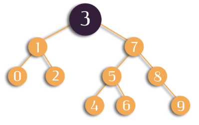

# Proje 3

 


>**1. [ 7 , 5 , 1 , 8 , 3 , 6 , 0 , 9 , 4 , 2 ] -> Binary-Search-Tree aşamalarını yazınız.**


## root = 3
```cs
1. [7] -> root'un sağında
2. [5] -> root'un sağında, node [7]'nin solunda
3. [1] -> root'un solunda
4. [8] -> root'un sağında, node [7]'nin sağında
5. [6] -> root'un sağında, node [7]'nin solunda, node [5]'in sağında
6. [0] -> root'un solunda, node [1]'in solunda
7. [9] -> root'un sağında, node [7]'nin sağında, node [8]'in sağında
8. [4] -> root'un sağında, node [7]'nin solunda, node [5]'in solunda
9. [2] -> root'un solunda, node [1]'in sağında
```

